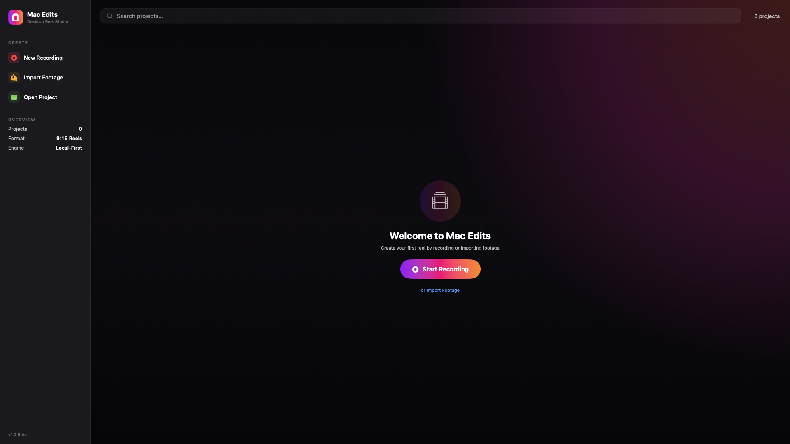
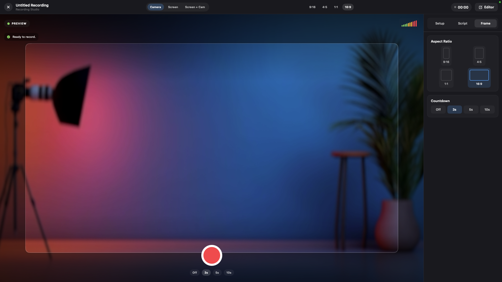
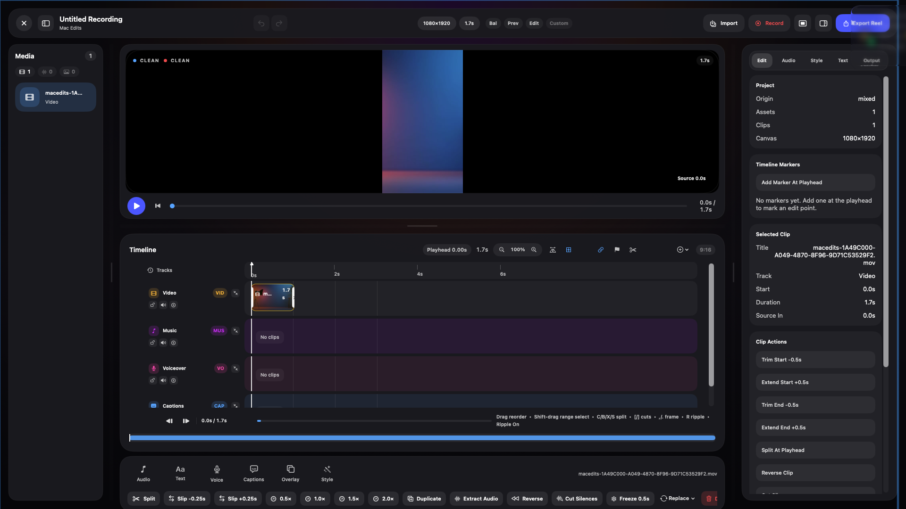
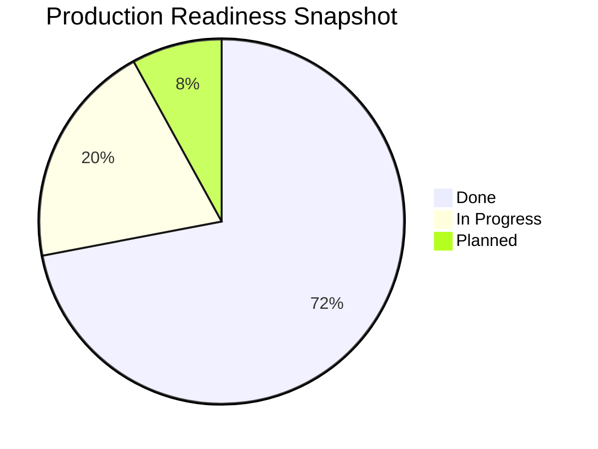
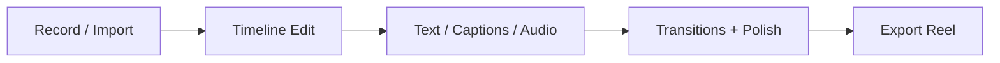
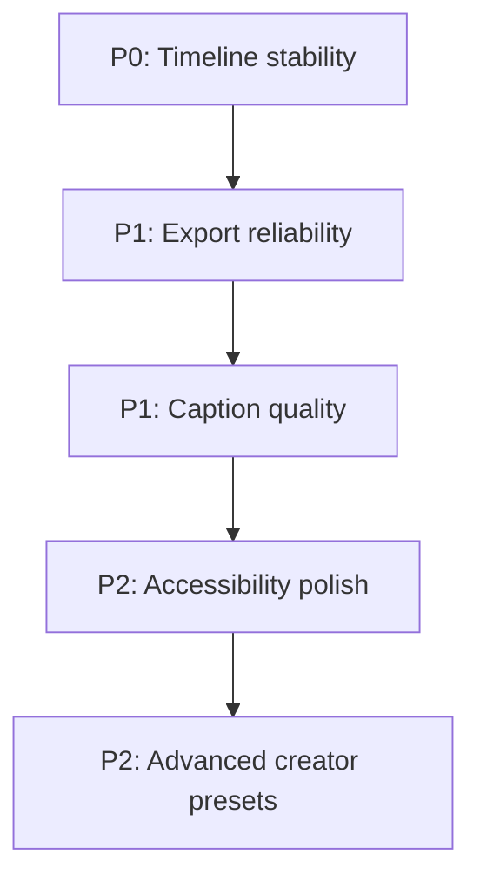

# MacEdits

> Local-first macOS reel editor built with SwiftUI + AVFoundation.

[](https://www.apple.com/macos/)
[](https://www.swift.org/)
[](https://developer.apple.com/xcode/swiftui/)
[](LICENSE)

I use Instagram Edits-style workflows a lot, but I wanted the same speed + control on Mac.  
So I built this for myself first, then thought: open source karte hain and build in public.

Thoda creator pain, thoda engineering madness, full dil se project.

## Why I built this

Most options are either:
- phone-only flow (fast, but limited when edits get serious),
- pro tools (powerful, but heavy for quick social edits).

MacEdits sits in the middle:
- fast record/import
- snappy timeline editing
- captions/text/transitions/audio controls
- local export, no backend dependency

## Screenshots

### Home


### Recording Studio


### Main Editor


## Current Status

| Area | Status | Notes |
|---|---|---|
| Recording Studio | Stable | Camera, Screen, Screen+Cam modes |
| Timeline Core | Stable | Split, trim, reorder, ripple editing |
| Transitions | In Progress | Preview parity edge cases remaining |
| Captions | In Progress | Improving reliability across devices/locales |
| Export | In Progress | Better fallback + diagnostics in progress |
| Accessibility | In Progress | Labels and keyboard polish ongoing |

## Progress Snapshot



## Editor Flow



## Tech Stack

- Swift 6.2
- SwiftUI
- AVFoundation
- ScreenCaptureKit
- Speech framework

## Run Locally

### Requirements

- macOS 14+
- Xcode 16+ (or Swift 6.2 toolchain)

### Commands

```bash
swift build
swift test
./scripts/run-dev-app.sh
```

The run script launches `MacEdits Dev.app` in `~/Applications`.

## Build Installer DMG

Create a distributable macOS installer image:

```bash
./scripts/build-dmg.sh --version 1.0.0 --build-number 1
```

Output:
- `dist/MacEdits.app`
- `dist/MacEdits-1.0.0.dmg`

Optional:
```bash
./scripts/build-dmg.sh --version 1.0.0 --build-number 1 --open
```

By default the script uses ad-hoc signing (`-`). Set `SIGN_IDENTITY` if you want Developer ID signing.

## Project Structure

```text
Sources/MacEdits/
  Core/
  Features/
    Home/
    Recording/
    Editor/
    Export/
    Text/
Tests/MacEditsTests/
scripts/
```

## Roadmap (Short + Realistic)



## Contributing

If this project looks interesting, jump in.

Great first contribution areas:
- timeline UX polish
- export edge-case handling
- caption quality tests
- accessibility fixes

Open an issue with clear repro steps, or ship a PR directly if the scope is clear.

## Support and Crash Reporting

- In-app support actions are available from the Home sidebar and the `Support` menu.
- `Contact Support` opens an email draft to `support@macedits.app`.
- `Report Bug` opens a prefilled GitHub issue.
- If MacEdits detects a recent crash log on startup, it prompts you to:
  - report crash on GitHub with a prefilled template, or
  - email support with crash context attached in the draft.

## Star this repo?

If MacEdits helped you, please star it.  
GitHub stars help contributors discover the project faster, and honestly, motivation bhi milti hai.

## Disclaimer

This is an independent open-source project and is not affiliated with Meta/Instagram.
